# FeedbackWebApp

# **Overview**

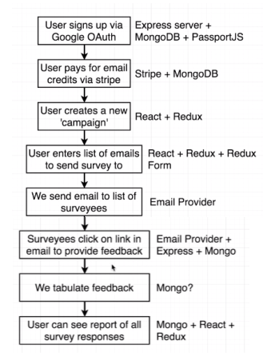   

  

# **Express + Server Side Architecture**

## Initialize package and install express

- **Node.js** is an open-source, cross-platform, back-end, JavaScript runtime environment that executes JavaScript code outside a web browser. Node.js lets developers use JavaScript to write command line tools and for server-side scripting—running scripts server-side to produce dynamic web page content before the page is sent to the user's web browser. 
- **npm**: is a package manager for the JavaScript programming language. It is the default package manager for the JavaScript runtime environment Node.js. It consists of a command line client, also called npm, and an online database of public and paid-for private packages, called the npm registry. 
- **npx**: is a tool for executing Node package. it is intended to help round out the experience of using packages from the npm registry — the same way npm makes it super easy to install and manage dependencies hosted on the registry, npx makes it easy to use CLI tools and other executables hosted on the registry.
- **webpack**:  is an open-source **JavaScript module bundler**. It is made primarily for JavaScript, but it can transform front-end assets such as HTML, CSS, and images if the corresponding loaders are included. webpack takes modules with dependencies and generates static assets representing those modules. 
- **module bundler**:  is a tool that takes pieces of JavaScript and their dependencies and bundles them into a single file, usually for use in the browser. 

````bash
mkdir server
npm init
# create package.json
npm install --save express
# create package-lock.json and /node_modules 
cat package.json
# cat command allows us to create single or multiple files, view contain of file, concatenate files and redirect output in terminal or files
````


 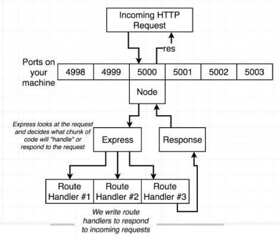 

## create index.js

 

## Set off server:

````bash
node index.js
````

Response from localhost:5000

 

  


# **Heroku Deployment**

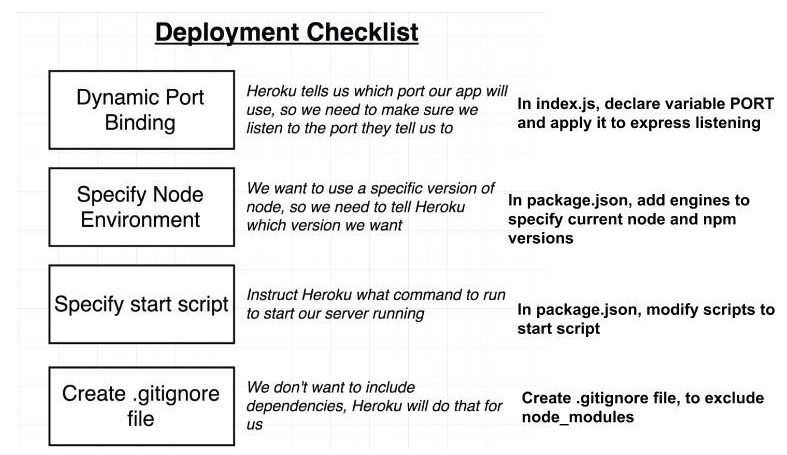 

index.js

````javascript
const express = require('express');
// CommonJS module syntax

// another syntax: if you have ES 2015 modules
// import express from 'express';


const app = express();

app.get('/', (req, res) => {
    res.send({bye : 'buddy'});
});

const PORT = process.env.PORT || 5000;
// dynamic port, or default using 5000

app.listen(PORT);
// port 

// route: localhost:5000
````

 

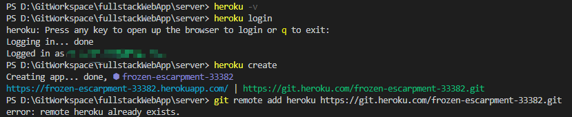 

 

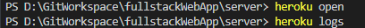 

 

# **PassportJS + Google OAuth**

 

 

 

Google Project Setup and OAuth Register:https://console.cloud.google.com/cloud-resource-manager?pli=1

Google OAuth client created:

Client ID & Client Secret

## Securing API Keys (the client secret)

 

Install passport and passport-google-oauth20

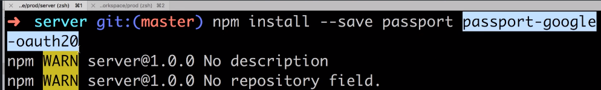 

Create config folder and keys.js under the folder

Within keys.js, store your google client ID and secret. Make sure the file is added to .gitignore

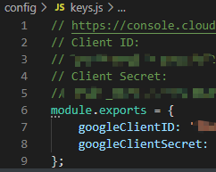 

  

## Authorize redirect URI and apply OAuth callback

 

# **Nodemon Setup**

With nodemon, there is no need to restart (node index.js) the app every time when changes are made. Instead of “node index.js”, we can set off “npm run dev” and if any change is added, server will be restarted automatically.

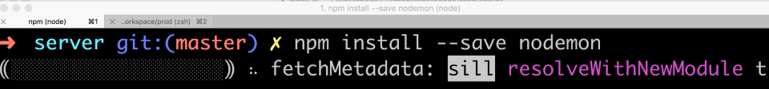 

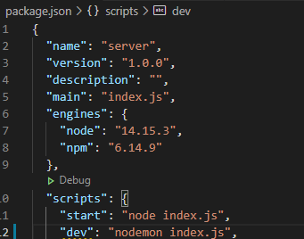   

# **Server Structure Refactor**

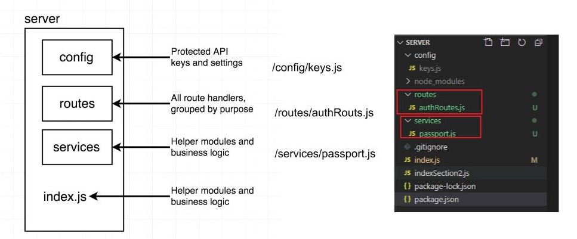 

   

 

# **Authentication Theory and Signing in User with OAuth**

 

 

 

## OAuth

OAuth: cookie/**token**? based authentication 验证 (Authorization 授权)

**OAuth** is an [open standard](https://en.wikipedia.org/wiki/Open_standard) for access [delegation](https://en.wikipedia.org/wiki/Delegation_(computer_security)), commonly used as a way for Internet users to grant websites or applications access to their information on other websites but without giving them the passwords.

 

 

## OAuth 2.0 v.s. OpenID v.s. JWT 

- **OpenID**  is an [open standard](https://en.wikipedia.org/wiki/Open_standard) and [decentralized](https://en.wikipedia.org/wiki/Decentralized) [**authentication**](https://en.wikipedia.org/wiki/Authentication) [protocol](https://en.wikipedia.org/wiki/Communications_protocol). Promoted by the non-profit [OpenID Foundation](https://en.wikipedia.org/wiki/OpenID#OpenID_Foundation), it allows users to be authenticated by co-operating sites (known as [relying parties](https://en.wikipedia.org/wiki/Relying_party), or RP) using a third-party service, eliminating the need for [webmasters](https://en.wikipedia.org/wiki/Webmaster) to provide their own ad hoc login systems, and allowing users to log into multiple unrelated websites without having to have a separate identity and password for each.

- **OAuth 2.0** is the industry-standard protocol for **authorization**.
  OpenID Connect 1.0 is a simple identity layer on top of the OAuth 2.0 protocol. It allows Clients to verify the identity of the End-User based on the authentication performed by an Authorization Server, as well as to obtain basic profile information about the End-User in an interoperable and REST-like manner.

  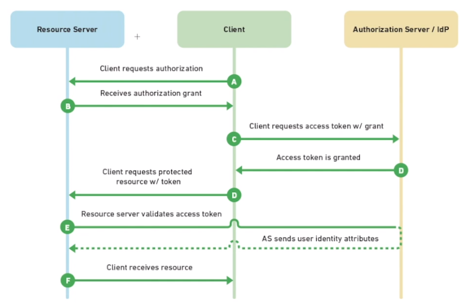 

  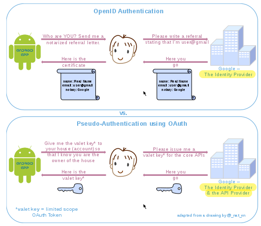 

- **JSON Web Token (JWT)** is an open standard ([RFC 7519](https://tools.ietf.org/html/rfc7519)) that defines a compact and self-contained way for securely transmitting information between parties as a JSON object. This information can be verified and trusted because it is digitally signed. JWTs can be signed using a secret (with the **HMAC** algorithm) or a public/private key pair using **RSA** or **ECDSA**.

  JWT can be used for **authorization** and **information exchange**.

  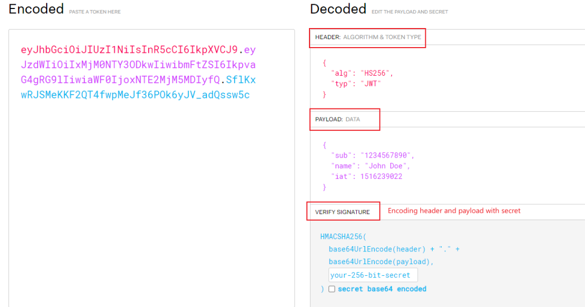 

  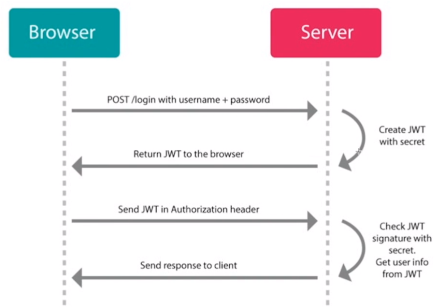  

## Cookie- based authentication v.s. Token-based authentication

 

- **Cookie-based authentication** is **stateful**. This means that an authentication record or **session** must be kept both server and client-side. The server needs to keep track of active sessions in a database, while on the front-end a cookie is created that holds a session identifier, thus the name cookie based authentication.

  (Client) Username/ Password -> (Server) verify credentials in DB and create a session

  (Server) cookie (with session id) -> (Client) save cookie locally and carry it for subsequence request

- **Token-based authentication** is **stateless**. The server does not keep a record of which users are logged in or which JWTs have been issued. Instead, every request to the server is accompanied by a token which the server uses to verify the authenticity of the request. The token is generally sent as an addition Authorization header in the form of Bearer {JWT}, but can additionally be sent in the body of a POST request or even as a query parameter. 

- **Cookie:**

  An **HTTP cookie** (also called **web cookie**, **Internet cookie**, **browser cookie**, or simply **cookie**) is a small piece of [data](https://en.wikipedia.org/wiki/Data_(computing)) stored on the [user](https://en.wikipedia.org/wiki/User_(computing))'s computer by the [web browser](https://en.wikipedia.org/wiki/Web_browser) while [browsing](https://en.wikipedia.org/wiki/Browsing) a [website](https://en.wikipedia.org/wiki/Website). Cookies were designed to be a reliable mechanism for websites to remember [**stateful**](https://en.wikipedia.org/wiki/Program_state) information (such as items added in the shopping cart in an [online store](https://en.wikipedia.org/wiki/Online_shopping)) or to record the user's browsing activity (including clicking particular buttons, [logging in](https://en.wikipedia.org/wiki/Access_control), or recording which [pages were visited in the past](https://en.wikipedia.org/wiki/Web_browsing_history)). They can also be used to remember pieces of information that the user previously entered into [form fields](https://en.wikipedia.org/wiki/Form_(HTML)), such as names, addresses, [passwords](https://en.wikipedia.org/wiki/Password), and [payment card numbers](https://en.wikipedia.org/wiki/Payment_card_number).

  Cookies are sent as HTTP headers.

- **Token:**

  A **security token** is a [peripheral device](https://en.wikipedia.org/wiki/Peripheral_device) used to gain access to an electronically restricted resource. The token is used in addition to or in place of a [password](https://en.wikipedia.org/wiki/Password). It acts like an electronic key to access something.

  Most of the time, tokens are sent using HTTP headers. Not all tokens have session info, but it can, like JWT token has extra data for session

- **HTTP Headers:**

  *HTTP header fields** are components of the header section of [request](https://en.wikipedia.org/wiki/Hypertext_Transfer_Protocol#Request_message) and [response](https://en.wikipedia.org/wiki/Hypertext_Transfer_Protocol#Response_message) messages in the [Hypertext Transfer Protocol](https://en.wikipedia.org/wiki/Hypertext_Transfer_Protocol) (HTTP). They define the operating parameters of an HTTP 

- **Session**:

  In [computer science](https://en.wikipedia.org/wiki/Computer_science) and [networking](https://en.wikipedia.org/wiki/Computer_network) in particular, a session is a temporary and interactive information interchange between two or more communicating devices, or between a computer and user (see [login session](https://en.wikipedia.org/wiki/Login_session)). A session is established at a certain point in time, and then ‘torn down’ - brought to an end - at some later point. An established communication session may involve more than one message in each direction. A session is typically [stateful](https://en.wikipedia.org/wiki/Stateful), meaning that at least one of the communicating parties needs to hold current state information and save information about the session history in order to be able to communicate, as opposed to [stateless](https://en.wikipedia.org/wiki/Stateless_server) communication, where the communication consists of independent requests with responses.

- **HTTP Session:**

  An HTTP session is a sequence of network request–response transactions. An HTTP client initiates a request by establishing a [Transmission Control Protocol](https://en.wikipedia.org/wiki/Transmission_Control_Protocol) (TCP) connection to a particular [port](https://en.wikipedia.org/wiki/TCP_and_UDP_port) on a server (typically port 80, occasionally port 8080; see [List of TCP and UDP port numbers](https://en.wikipedia.org/wiki/List_of_TCP_and_UDP_port_numbers)). An HTTP server listening on that port waits for a client's request message. Upon receiving the request, the server sends back a status line, such as "HTTP/1.1 200 OK", and a message of its own. The body of this message is typically the requested resource, although an error message or other information may also be returned.

- **URI and URL**

  URI (Uniform Resource **Identifier**) is an **identifier** of a specific resource. 

  URL (Uniform Resource **Locator**) is a special type of identifier that also tells you how to access it, such as HTTPs, frp, etc. 

  If the protocol (https, http, ftp, etc.) is either present or implied for a domain, you should call it a URL.

  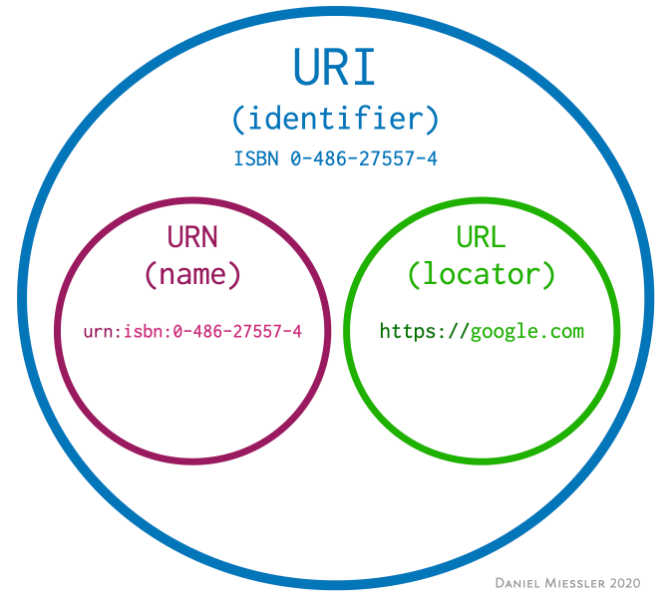 

  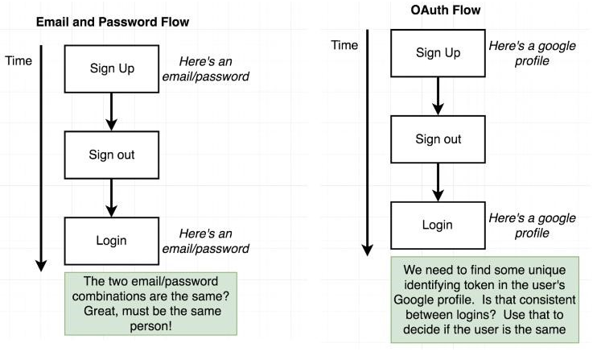  
  
   

# **Mongoose + Mongo DB**

       

 

## Setup and Config MongoDB Atlas Cluster

MongoDB Atlas is the global cloud database service for modern applications.
Deploy fully managed MongoDB across AWS, Google Cloud, and Azure with best-in-class automation and proven practices that guarantee availability, scalability, and compliance with the most demanding data security and privacy standards.

https://www.mongodb.com/cloud/atlas

Create cluster , DB user

## Install Mongoose

 

## Using Mongoose to connect Mongo

**** 

keys.js

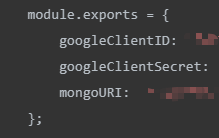 

**** 

## Create Mongoose Model Class

**** 

## Create /models/User.js for Mongoose Model Class

**** 

## Import Mongoose Model Class in index.js

**** 

## Apply Mongoose Model Class to passport.js, to save googleId to Mongo DB when authentication

**Note**: instead of import the User.js file, we are applying mongoose model in a different way as below

**** 

## Import /models/User in index.js

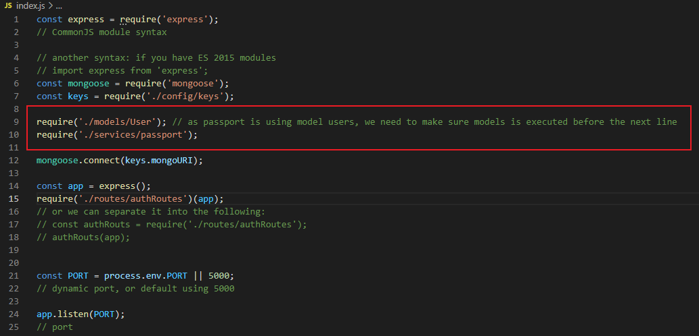  

## If there is existing googleID, don't create a record in Mongo DB

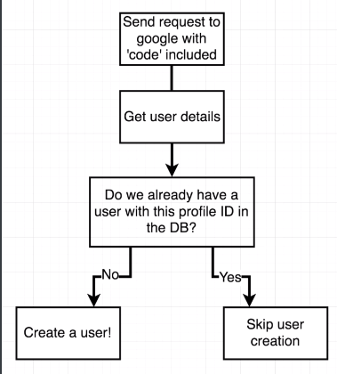  

passport.js

````javascript
const passport = require('passport');
const GoogleStrategy = require('passport-google-oauth20').Strategy;
const keys = require('../config/keys');
const mongoose = require('mongoose');

const User = mongoose.model('users');

passport.use(
    new GoogleStrategy(
        {
            clientID: keys.googleClientID,
            clientSecret: keys.googleClientSecret,
            callbackURL: '/auth/google/callback'
        }, 
        (accessToken, refreshToken, profile, done) => {
            // console.log('access token: ', accessToken);
            // console.log('refresh token: ', refreshToken);
            // console.log('profile: ', profile)
            User.findOne({ googleId: profile.id})
                .then((existingUser) => {
                    if (existingUser){
                        // we already have a record with the given profile ID
                    } else {
                        // we don't have a record with this ID, make a new record
                        new User({googleId: profile.id}).save();
                    }
                })
        }
    )
);
````

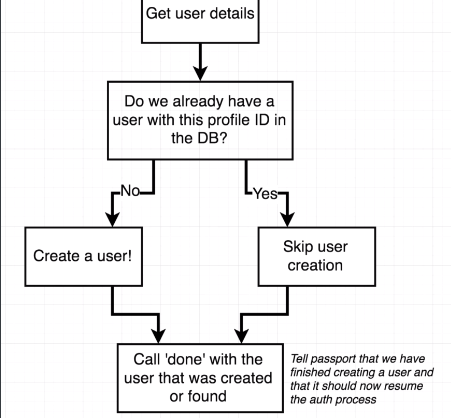 

passport.js

````javascript
const passport = require('passport');
const GoogleStrategy = require('passport-google-oauth20').Strategy;
const keys = require('../config/keys');
const mongoose = require('mongoose');

const User = mongoose.model('users');

passport.use(
    new GoogleStrategy(
        {
            clientID: keys.googleClientID,
            clientSecret: keys.googleClientSecret,
            callbackURL: '/auth/google/callback'
        }, 
        (accessToken, refreshToken, profile, done) => {
            // console.log('access token: ', accessToken);
            // console.log('refresh token: ', refreshToken);
            // console.log('profile: ', profile)
            User.findOne({ googleId: profile.id})
                .then((existingUser) => {
                    if (existingUser){
                        // we already have a record with the given profile ID
                        done(null, existingUser);
                    } else {
                        // we don't have a record with this ID, make a new record
                        new User({googleId: profile.id})
                            .save()
                            .then(user => done(null, user));
                    }
                })
        }
    )
);
````


## Encoding User and Deserialize User

serialize and deserialize will be called automatically by passport with User model

serialize and deserialize Mongo DB ID, rather than profile id

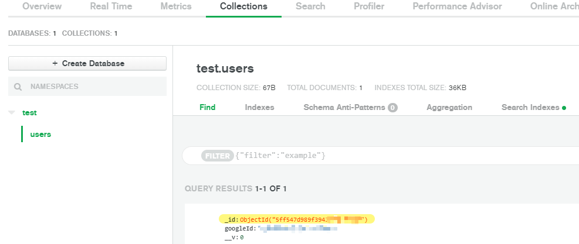 

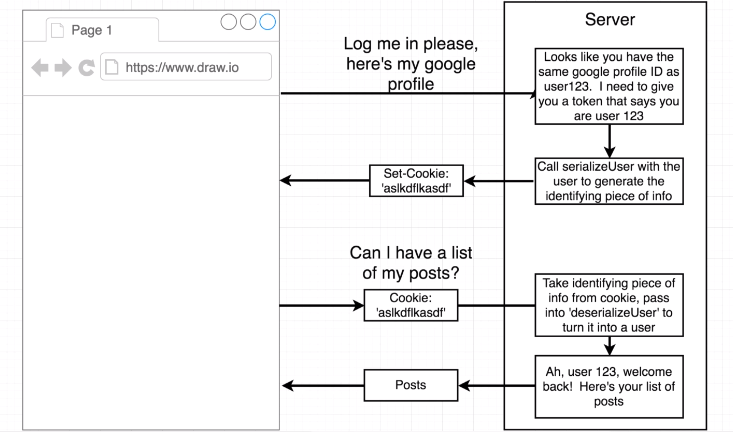  

 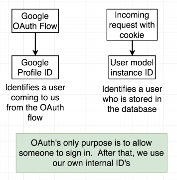  

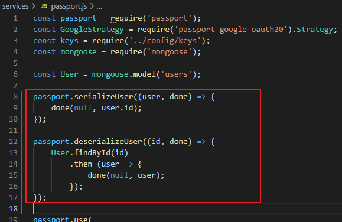 

# cookie-session + Enable Cookie

## Use cookie-session

````bash
npm install --save cookie-seesion
````

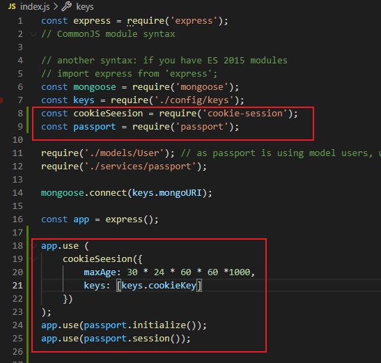  

## app.use()

app.use()  is the middleware and applied to all router handlers

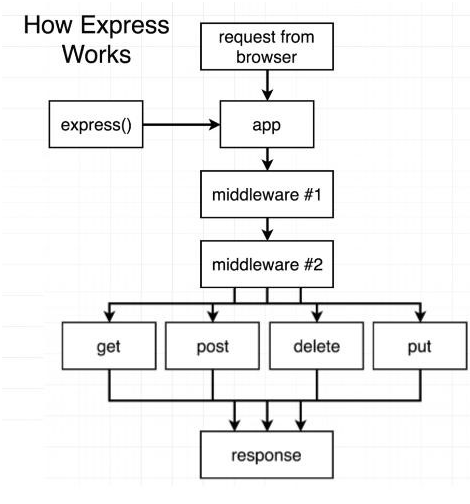  

## Test session

if response just send the request session, you will find the session context, where the user id is the same as user id in your mongo DB

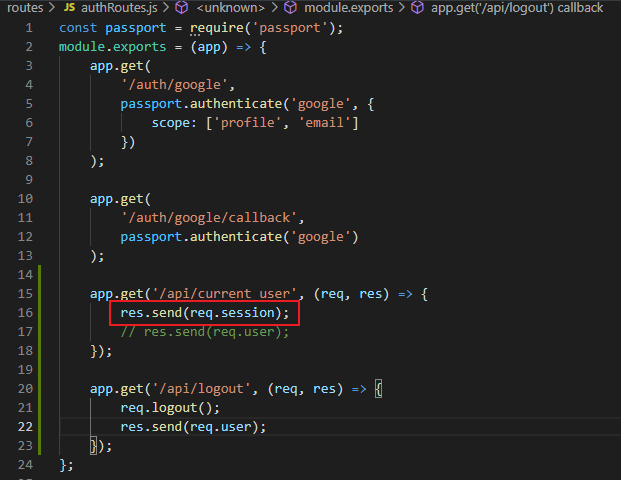 

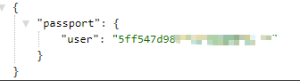 

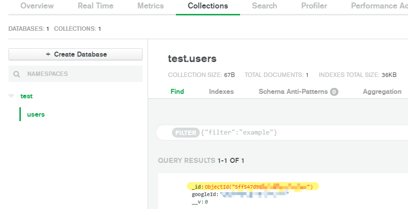 

## Cookie-session v.s. Express-session

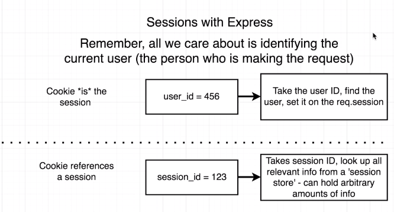  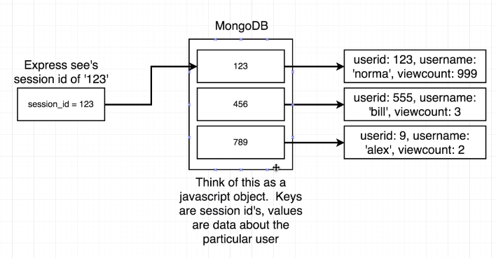 


# Workflow of every request

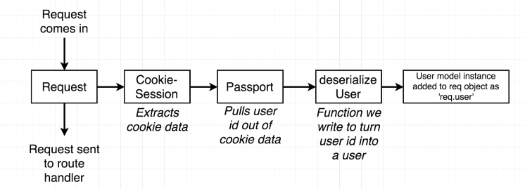  

# Testing authentication by adding a route handler to deal with response

After login, you should now get the current user 

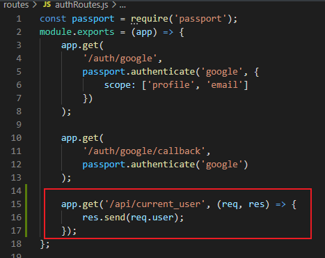  

Login： http://localhost:5000/auth/google/

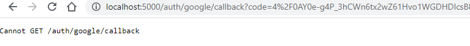  

Current User： http://localhost:5000/api/current_user

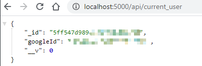  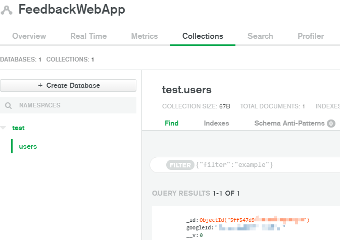 

# Log out Users

Passport attached a couple of functions to request object so that we can manipulate user's authentication status

add a logout router

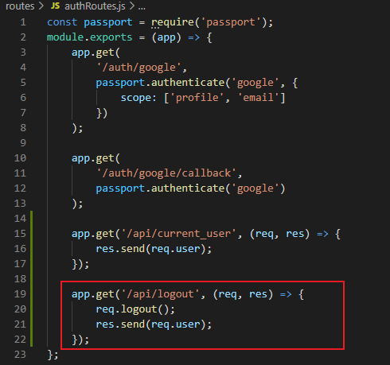  

Logout： http://localhost:5000/api/logout

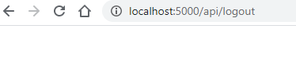 

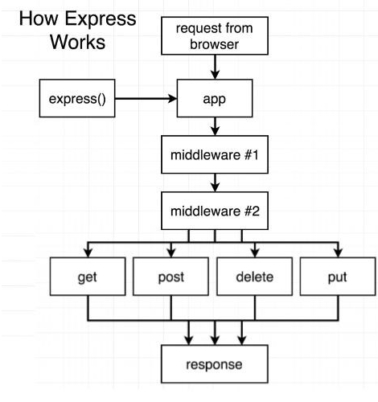  


# Dev vs Prod Environments (Heroku)

Dev and Prod have different set of Keys

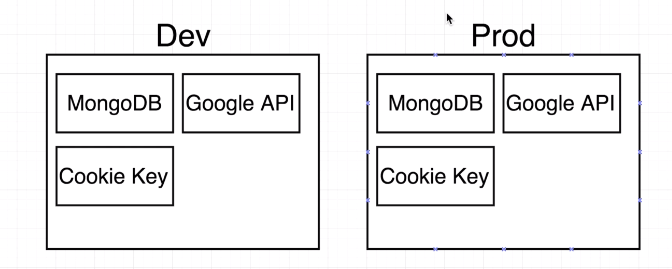   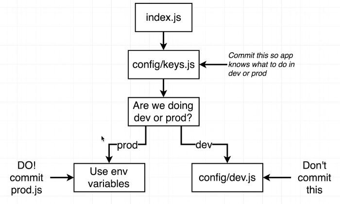  

Create a different MongoDB Atlas project and user for prod

Create a different Google Project  with OAuth APIs and credentials for prod

Within config folder, copy keys.js to dev.js, and create prod.js.

In keys.js, add logic to determine to use dev or prod keys.

Update .gitignore

keys.js

````javascript
// keys.js - figure out what ser of credentials to return

if (process.env.NODE_ENV === 'production'){
    // if app is running on Heroku, it will be automatically 'production'
    // we are in production - return the prod set of keys
    module.exports = require('./prod');

} else {
    // app running locally
    // we are in development - return the dev keys
    module.exports = require('./dev');
}
````

dev.js

```` javascript
// dev.js - Don't commit this file
module.exports = {
    googleClientID: 'xxxxxxx',
    googleClientSecret: 'xxxxxx',
    mongoURI: 'xxxxxx',
    cookieKey: 'xxxx'
};
````

prod.js

````javascript
// prod.js =- production keys here
module.exports = {
    googleClientID: process.env.GOOGLE_CLIENT_ID,
    googleClientSecret: process.env.GOOGLE_SECRET,
    mongoURI: process.env.MONGO_URI,
    cookieKey: process.env.COOKIE_KEY
};
````

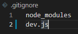  

Set up Config  Vars in Heroku

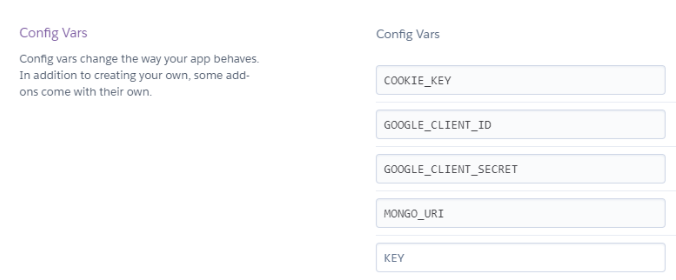 

After that, commit and start heroku can run into the following error:

  

Google Strategy is using relative path and it determines what domain need to be appended to the request

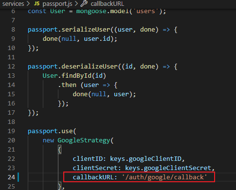   

Google Strategy doesn't trust any request that comes through a proxy, while Heroku is using proxy to distribute its servers

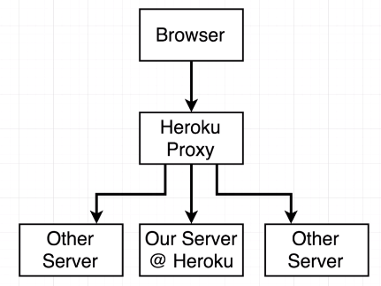  

Two ways to fix it:

1.use absolute path in Google Strategy

2.tell Google Strategy to trust all requests through proxy by adding one more setting

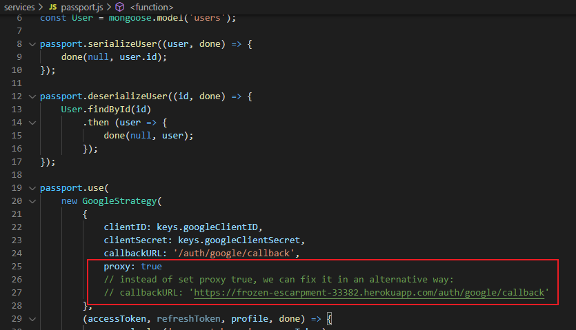  

# Client Side Setup

## npx create React App Generation

You **don’t** need to install or configure tools like webpack or Babel. They are preconfigured and hidden so that you can focus on the code.

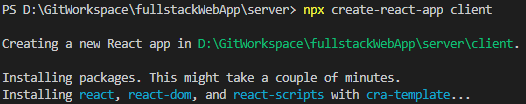  

client folder is then created

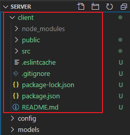  

## React Server

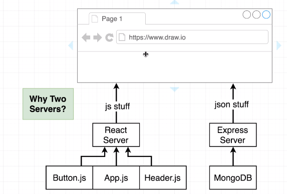  


## concurrently + Start both Client (React Server) and Server (Express Server)

Use concurrently module to start both server in one command

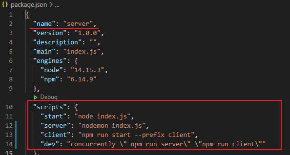  

  

  


## Create React App's Proxy

- what is proxy?

  In [computer networking](https://en.wikipedia.org/wiki/Computer_networking), a **proxy server** is a [server](https://en.wikipedia.org/wiki/Server_(computing)) application or appliance that acts as an [intermediary](https://en.wikipedia.org/wiki/Intermediary) for requests from [clients](https://en.wikipedia.org/wiki/Client_(computing)) seeking resources from servers that provide those resources.[[1\]](https://en.wikipedia.org/wiki/Proxy_server#cite_note-1) A proxy server thus functions on behalf of the client when requesting service, potentially masking the true origin of the request to the resource server.

- Why proxy?

  For testing, adding relative link to React page and redirect, will run into an error. Because it will append current domain you are currently visiting to the relative link, which will be http://localhost:3000/auth/google. React server is running on port 3000, however, Express server is running on port 5000. So we are expecting http://localhost:5000/auth/google instead.

  

- Proxy setup is only needed for Dev Mode

    

  
  
  Because in Production Mode, we will build the app and deploy it on Heroku. Create-React-App Server will no longer be run, and only Express server will be running in Prod mode.
  
   
  
   
  
- How ?

   

   

- One more thing to add for redirect, to avoid the following error:

    

  Whitelist "http://localhost:3000/auth/google/callback“ under "Authorized redirect URIs" of your dev app to allow to redirect back to port 3000

​	 

 

## Why this architecture

- Current Architecture:

  

- Why not this architecture below?

   

- Reasons:

1. cookie will not be included by default due to security concern

 

similar to domain change =>

   

2. Cross-origin resource sharing (CORS) : is a mechanism that allows restricted resources on a web page to be requested from another domain outside the domain from which the first resource was served.

   Browser security feature

  

- Go through the flow:  

proxy changes domain of these requests to http://localhost:5000/

 

 

   

 

# Developing the Client Side

## promise

A **Promise** is an object represents the eventual completion (or failure) of an **asynchronous** operation and its resulting value.

Essentially, a promise is a returned object to which you attach callbacks. which has three states: pending, fulfilled, rejected.

One of the great things about using promises is **chaining**.

## Async Function

An async function is a function declared with the **async** keyword. Async functions are instances of the AsyncFunction constructor, and the **await** keyword is permitted within them. The async and await keywords enable asynchronous, promise-based behavior to be written in a cleaner style, avoiding the need to explicitly configure promise chains.

## JavaScript ES 2017 new syntax - Async/ Await

- Comparison

     

    

- Old Syntax

   

  

     

 

- New Syntax

   

  

    

  - New Syntax with Arrow function

     

    

     


## Refactor with Async/ Await

   =>

 

# Front End Tech 

## Intro

Green: back-end
Blue: front-end

 

Components:

 

   

## Client React Setup

  

​     

Install modules under client folder

 

 

Create index.js under /client/src, which is responsible for Redux setup
Create a folder, /components, under /client/src, and a file, App.js, under the folder, which is responsible for initial view layer

  

 

## Redux Review and Setup

  

  

 

 


## The Auth Reducer

create reducers folder under /client/src
within the folder, create reducer.js and index.js

Note: the purpose of calling this index.js is to allow us to import the reducers directory, which by convention with "import" statement will automatically give us any file inside the directory that is call index.js

 

 

 


## React Router Setup

**react-router** is used to navigate between multiples pages/views of your front-end app/website. Usually in **a single page app**, where pages are loaded **dynamically**.
**express router** is a way to return static content (index.html, image.png...) AND to handle api calls server-side usually triggering database logic. It handles backend routes.

  

   

## Create class-based component for Header

create Header.js file under /client/components folder

class-based component is used to have function inside which will be responsible for deciding what to render inside component

 

 

## Materialize CSS handled by Webpack

 

 

https://materializecss.com/navbar.html

  

 

 ## Axios & Redux-Thunk + fetchUser action

**Redux Thunk middleware**: allows you to write action creators that **return a function** instead of an action. The thunk can be used to **delay the dispatch of an action, or to dispatch only if a certain condition is met**. The inner function receives the store methods dispatch and getState as parameters.

An action creator that returns a function to perform asynchronous dispatch.

**Axios**:  is a **promise based** HTTP client for the browser and Node.js. Axios makes it easy to send **asynchronous HTTP requests to REST endpoints** and perform CRUD operations. It can be used in plain JavaScript or with a library such as Vue or React.

  

- Install axios and redux-thunk

   

- Apply redux-thunk

   

  create actions folder under /client/src folder
  within the folder, create index.js and types.js files

    

- redux-thunk structure 

    

- Apply Axios

   

## Refactor the app.js

make App class-based component and make sure the app component can actually call an action creator

 

Add log to authReducer for testing

 

 

## Refactor actions/index.js with Async/Await

     =>    

After Action is separated into a function:

  =>  

## Under payload, we only need data

 

After Action is separated into a function:

 

 


## AuthReducer Return values by different cases

 

AuthReducer Return values, default state is null

 

Accessing State in the Header.js and test by console log

 

When logged in:

 

After logged out:

 

## render content depending on auth value

 

# redirect a Logged in User on Auth 

- Back end

 

 After login, it's redirected to dashboard:

 

# redirect on Log out

Two options:

 

Here, we use option one, since for user experience, it doesn't matter if it takes a little bit longer to log out in most case

- Front end

 

- Back end

Redirect to root, so that after log out, page will be refreshed

 

# Landing component

- Front end

Create a Landing component

 

 

# Link Tags

Link the logo "Emaily" at the left upper corner to to root pages, and the redirects depends on if a user is logged in

Logged in: Dashboard page

Logged out: Landing page

 

 

If a user is logged in, clicking logo will redirect to dashboard, otherwise, it will redirect to root page

 

 

# Change class-based component to function-based component


App.js

 

Header.js

 


# Handling Payments

## Construture

Green: back-end
Blue: front-end

   

Add Credits:

 

Use **Stripe** to take care of payment processor

 

## Stripe Billing Process

 

## Front-end

### sign up Stripe

 

### install front-end module to handle stripe, react-stripe-checkout

 

### Setup API Keys

- Back End

  

 

- Front End

React App Adding Custom Environment Variables

https://create-react-app.dev/docs/adding-custom-environment-variables/ 

Under /client folder, create .env.development and .env.production files, and add both STRIPE publishable key

 

### Payments Component

 

 

 

id (token) is representing pending charge in memory. card info contains only last four digits

 

Adding more info in StripeCheckout and some styling 

 

 

 

### Add actions to handleToken

 

### Add connect to Payments and map dispatch to props

 

## Back-end

### install back-end module to handle stripe, stripe

https://www.npmjs.com/package/stripe 

https://stripe.com/docs/api/charges/create 

 

### install middleware body-parser

https://www.npmjs.com/package/body-parser

when you make post requests to use Express Server, Express does not by default parse the request payload. This is a middleware to parse it and make it available anywhere in the application. Parse incoming request bodies in a middleware before your handlers, available under the `req.body` property.

 

### Add billingRountes for post request handler in back-end

 

 

 

### Create a Charge Object

 

### Adding credits to a User

 

   

 


### Add Route-Specific Middleware to make sure users are logged in

 

 

 

## Display Credits

 

 


# Back End to Front End Routing in Production

## Express with Create-React-App & Routing in Production

 

generate production build

 

In Prod Mode, Express Server need to recognize that there are some routes that it is responsible for; some routes need to send to index.html (React Routes); and some routes that are trying to access specific assets like the main.js file

 

 

## Deployment Options

We are taking option #2 

 

https://devcenter.heroku.com/articles/nodejs-support 

    

 

  

# Mongoose for Survey Creation

## Overview Structure

  

Server Routes

 

## Survey DB Model

 

  =>   => 


 

  

 

We are not using the structure below, because of the physical limited Mongo Size for a single record. In the structure below, approximately we can only have 200k recipients in total for each User, while the structure above allows each user to have multiple survey (each survey has limitation of 200K recipients)

   

 

 

 

## Survey Creation Route

  

  

  =》   

 

 

 

 

## SendGrid

A **webhook** in [web development](https://en.wikipedia.org/wiki/Web_development) is a method of augmenting or altering the behavior of a [web page](https://en.wikipedia.org/wiki/Web_page) or [web application](https://en.wikipedia.org/wiki/Web_application) with custom [callbacks](https://en.wikipedia.org/wiki/Callback_(computer_programming)). These callbacks may be maintained, modified, and managed by third-party users and developers who may not necessarily be affiliated with the originating website or application.

  =》 

Register SendGrid

Add API key to both dev.js and Heroku

    

 

install module

 

## Mailer and Templates setup

     


 

 

 

Test:

 

   


 ## Polish Route Handler

  

 

Add redirectDomain in prod.js, dev.js and heroku config vars

 

 

 

   

 

 

# Back to the Client

  


 